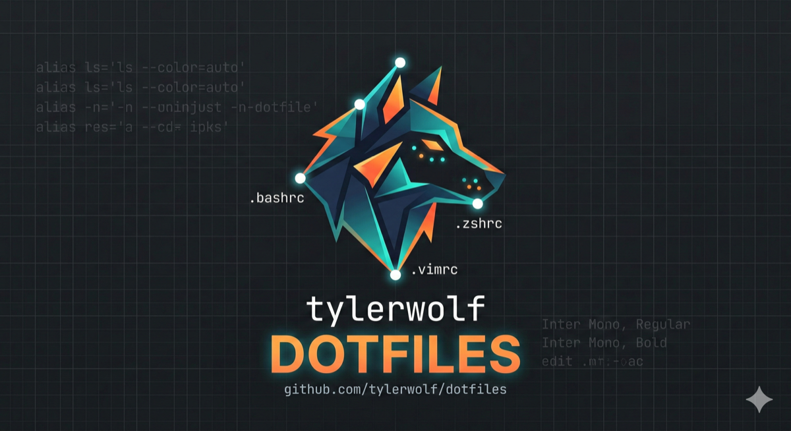

<p align="center">
  
</p>

<p align="center">
  <a href="https://github.com/tylerwolf/dotfiles/actions/workflows/ci.yml"></a>
  <a href="LICENSE"></a>
  
</p>

<p align="center">
  Topic-based dotfiles for macOS — organized, tested, and auto-updating.
</p>

---

## Install

```console
git clone git@github.com:tylerwolf/dotfiles.git ~/.dotfiles
cd ~/.dotfiles
./script/bootstrap
```

Bootstrap will:
1. Set up your git author name/email (interactive, first run only)
2. Symlink all `*.symlink` files into `$HOME` (existing files backed up with `.backup` suffix)
3. Install Homebrew and everything in the `Brewfile`
4. Run all topic `install.sh` scripts (antidote, asdf, git config, autoupdate launchd)

## What's Included

### Topics

| Topic | Purpose |
|-------|---------|
| `antidote/` | Zsh plugin manager (replaces antigen/oh-my-zsh) |
| `asdf/` | Multi-runtime version manager (Node, Ruby, Python, etc.) |
| `atuin/` | Synced, searchable shell history |
| `autoupdate/` | Launchd agent that pulls & re-runs installers every 2 hours |
| `direnv/` | Per-directory environment variables |
| `fzf/` | Fuzzy finder integration and key bindings |
| `git/` | Git config, aliases, and global ignore |
| `homebrew/` | Brewfile with all packages, casks, and fonts |
| `macos/` | macOS system/Finder/Dock preferences |
| `system/` | Shell aliases, environment, and PATH setup |
| `vim/` | Vim configuration |
| `xcode/` | Xcode Command Line Tools installer |
| `zoxide/` | Smarter `cd` with directory frecency |
| `zsh/` | Zsh config, prompt, and plugin loading |

### Modern CLI Replacements

All installed via Homebrew:

| Tool | Replaces | What it does |
|------|----------|-------------|
| [`eza`](https://github.com/eza-community/eza) | `ls` | Modern ls with git awareness and tree view |
| [`bat`](https://github.com/sharkdp/bat) | `cat` | Cat with syntax highlighting and line numbers |
| [`fd`](https://github.com/sharkdp/fd) | `find` | Fast, user-friendly file finder |
| [`ripgrep`](https://github.com/BurntSushi/ripgrep) | `grep`/`ack` | Blazing-fast recursive code search |
| [`zoxide`](https://github.com/ajeetdsouza/zoxide) | `cd`/`z` | Smarter cd that learns your habits |
| [`git-delta`](https://github.com/dandavella/delta) | `diff` | Beautiful git diffs with syntax highlighting |
| [`atuin`](https://github.com/atuinsh/atuin) | `history` | Synced, searchable shell history |
| [`tldr`](https://github.com/tldr-pages/tldr) | `man` | Simplified, example-driven man pages |
| [`btop`](https://github.com/aristocratos/btop) | `top`/`htop` | Beautiful system resource monitor |

## How It Works

Everything is organized into **topic directories** (e.g., `git/`, `fzf/`, `zsh/`). The zsh loader (`zsh/zshrc.symlink`) auto-discovers files by naming convention:

| Pattern | When loaded | Purpose |
|---------|------------|---------|
| `path.zsh` | First | `$PATH` modifications |
| `*.zsh` | Second | Config, aliases, functions |
| `completion.zsh` | Last | Shell completions |
| `install.sh` | On bootstrap/update | One-time setup for the topic |
| `*.symlink` | On bootstrap | Symlinked to `$HOME/.filename` |

**`bin/`** is added to `$PATH` — anything in there is available everywhere.

## Keeping Up to Date

A launchd agent (installed by `autoupdate/install.sh`) runs `bin/dot_update` every 2 hours, which pulls the latest changes, updates submodules, re-runs all installers, and refreshes antidote plugins.

## Local Customization

These files are not checked in and won't be overwritten:

- **`~/.localrc`** — sourced at end of zshrc (secrets, machine-specific config)
- **`~/.gitconfig.local`** — included by gitconfig for machine-specific git settings

## macOS Defaults

Optionally apply preferred macOS system/Finder/Dock settings:

```console
./macos/set-defaults.sh
```

Requires a logout or restart to take full effect.

## Testing & CI

A GitHub Actions CI pipeline runs on every push: shellcheck linting on Ubuntu and a full bootstrap + verification on a macOS runner.

Locally, you can verify a bootstrapped machine or test in a sandboxed VM:

```console
make lint        # shellcheck all shell scripts
make verify      # run post-bootstrap verification checks
make vm-setup    # one-time: install Tart, pull macOS Tahoe base image
make vm-test     # automated: clone VM, run bootstrap, verify results, cleanup
make vm-shell    # interactive: clone VM, print SSH info for manual exploration
make vm-cleanup  # stop and delete all leftover dotfiles-test-* VMs
```

## Adding a New Topic

1. Create a directory named after the tool (e.g., `node/`)
2. Add `path.zsh` if PATH changes are needed
3. Add `config.zsh` or `aliases.zsh` for shell configuration
4. Add `install.sh` for one-time setup
5. Add `*.symlink` files for dotfiles that should land in `$HOME`

Existing files are backed up with `.backup` suffix during symlink creation.

## Credits

Forked from [holman/dotfiles](https://github.com/holman/dotfiles), with ideas from [caarlos0/dotfiles](https://github.com/caarlos0/dotfiles).

## License

[MIT](LICENSE)
